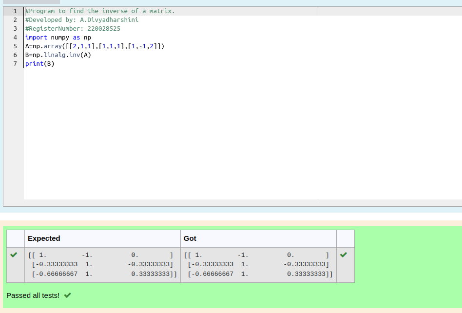

# INVERSE-OF-A-MATRIX
## Aim:
To write a python program to find the inverse of a matrix
## Equipment’s required:
1. 	Hardware – PCs
2. 	Anaconda – Python 3.7 Installation / Moodle-Code Runner
## Algorithm:
### Step 1: 
Import the numpy module to use the built-in function for calculation 
### Step 2: 
Prepare the lists from each equations and assign in np.aaray()
### Step 3:
Using the np.linalg.solve(),we can find the solutions. 
### Step 4: 
End the program
## Program:
```
#Program to find the inverse of a matrix.
#Developed by: A.Divyadharshini 
#RegisterNumber: 220028525
import numpy as np
A=np.array([[2,1,1],[1,1,1],[1,-1,2]])
B=np.linalg.inv(A)
print(B)
```
## Output:

## Result:
Thus the inverse of given matrix is successfully solved using python program

